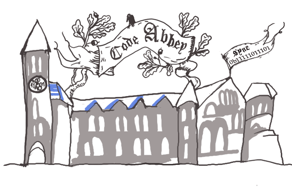

# Code Abbey

> Collection of programming problems to practice solving, learn to program and code, and win certificates.

This project is dedicated to learning programming and logic algorithms by solving computing problems available on the website https://www.codeabbey.com

## How to use this repository

Solved problems from the Code Abbey website and posted here should not be copied, but rather serve as a guide in the construction of algorithms to solve the proposed problems.

## Meta

Marcos Glasner - [https://github.com/Curio5813/CodeAbbey](https://github.com/Curio5813)

marcosglasner@gmail.com

